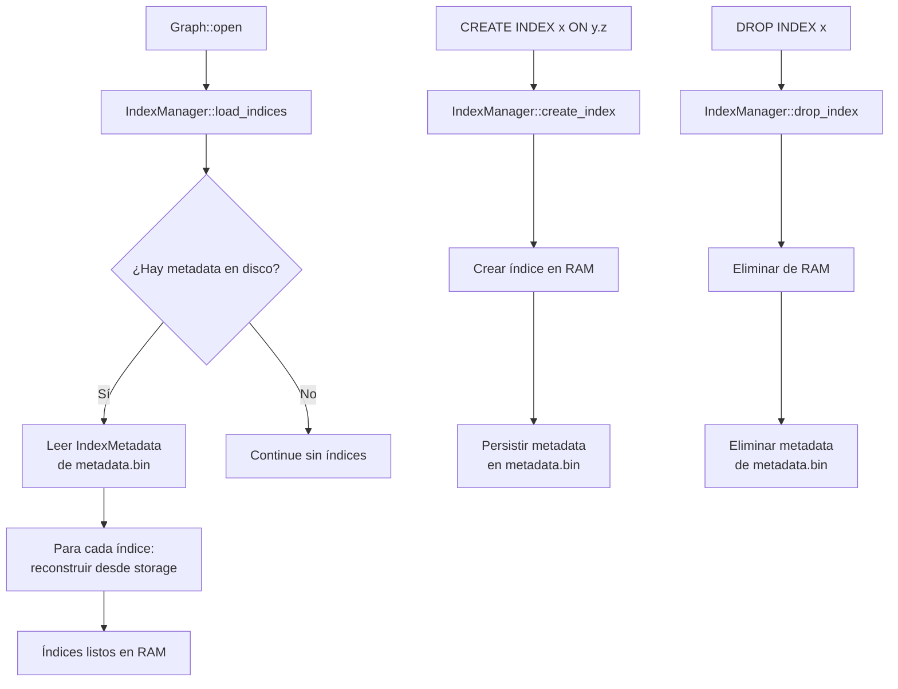

# Arquitectura del Ejecutor de Queries: Persistencia de Índices y Modelo Volcano 🌋

> **Audiencia**: Ingenieros que dan mantenimiento o extienden el motor de queries de NopalDB.
> **Versión**: v0.3.5+
> **Última actualización**: Febrero 2026

---

## Resumen Ejecutivo

Esta guía documenta dos mejoras críticas de producción implementadas en NopalDB v0.3.5:

| Mejora | Problema resuelto | Impacto |
|---|---|---|
| **Persistencia de Índices** | Los índices se perdían en cada restart | Queries indexadas disponibles inmediatamente al iniciar |
| **Ejecutor Streaming (Volcano Model)** | Queries cargaban todos los datos en RAM | Procesamiento row-by-row: N veces menos memoria intermedia en Scan |

---

## Parte 1 — Persistencia de Índices

### 1.1 El Problema Original

Antes de esta mejora, `IndexManager` mantenía los índices **únicamente en memoria**:

```rust
// ANTES (problemático)
pub struct IndexManager {
    indices: HashMap<String, Box<dyn Index>>,
    // Sin persistencia. Al reiniciar: HashMap vacío.
}
```

**Consecuencia crítica**: Al reiniciar NopalDB, todos los índices creados por el usuario desaparecían. Las queries que dependían de ellos caían al full-scan silenciosamente — sin error, solo lentísimas, o devolviendo resultados erróneos si el planner asumía que el índice existe.

### 1.2 La Solución: Estrategia Metadata + Rebuild

Elegimos la estrategia **"Guardar metadatos, reconstruir en startup"** (en lugar de serializar el índice completo en disco).

**¿Por qué esta estrategia?**

| Opción | Pros | Contras |
|---|---|---|
| Serializar índice completo (B-Tree en disco) | Startup instantáneo | Complejidad masiva, riesgo de corrupción, requiere WAL propio |
| **Metadata + Rebuild** ✅ | Simple, usa el WAL ya existente como fuente, nunca inconsistente | Startup más lento si hay muchos datos |
| Índices efímeros (sin cambio) | Sin costo | Pérdida de índices en cada reinicio — inaceptable para producción |

La estrategia de rebuild es la que usan bases de datos embebidas como **SQLite** (re-indexing al detectar índices faltantes) y librerías como **RocksDB** en modo recover.

### 1.3 Implementación

**Flujo de Datos:**



**Archivos clave:**

- [`src/index/mod.rs`](../../nopaldb/src/index/mod.rs) — `IndexManager::load_indices`, `save_metadata_internal`
- [`src/graph/mod.rs`](../../nopaldb/src/graph/mod.rs) — `Graph::open` llama `index_manager.load_indices`

**Formato de metadata persistida (archivo `metadata.bin`):**

```rust
// Ruta: <db_path>/indexes/metadata.bin
// Contenido: bincode(Vec<IndexMetadata>)
```

### 1.4 Garantías y Limitaciones

✅ **Garantías:**
- Los índices sobreviven reinicios normales
- Los índices son siempre consistentes con los datos (se reconstruyen desde la fuente de verdad)
- `DROP INDEX` elimina tanto el índice RAM como la metadata

⚠️ **Limitaciones conocidas:**
- El rebuild es O(n) en nodos. Bases muy grandes pueden tener startup lento
- No hay índices en disco persistentes (B-Tree files). Si en el futuro se necesita startup instantáneo, migrar a `lsm_tree` con índices en disco.

### 1.5 Test de Regresión

```bash
cargo test --test index_persistence
```

El test verifica: crear índice → reiniciar DB → verificar que el índice es funcional.

---

## Parte 2 — Ejecutor Streaming: El Modelo Volcano

### 2.1 El Problema Original: Ejecución Materializada

El ejecutor anterior era puramente **materializado**:

```rust
// ANTES: Todo en memoria antes de procesar
async fn execute_from(query: &Query) -> Result<Vec<Node>> {
    // Carga TODOS los nodos matching en un Vec
    graph.get_all_nodes().await        // → Vec<Node> completo en RAM
}

// Luego filter sobre el Vec completo en RAM
// Luego project sobre el Vec filtrado en RAM
```

**Análisis de memoria** para 1M nodos de 256 bytes promedio:
- `Vec<Node>` = ~256 MB en RAM solo para el scan inicial
- Con filtro: segundo `Vec` de ~256 MB
- Total intermedio: **~512 MB** por query concurrente

En producción con 100 queries simultáneas: **~51 GB** de RAM consumida. **OOM inevitable.**

### 2.2 La Solución: El Modelo Volcano (Iterador en Pull)

El **Modelo Volcano** (también llamado *Iterator Model* o *Pipeline Model*) es el paradigma dominante en bases de datos relacionales modernas. Fue formalizado por Goetz Graefe en 1994.

**Concepto central**: En lugar de que cada operador produzca su salida completa antes de pasarla al siguiente, cada operador expone un método `next()`. El operador raíz "jala" (pull) tuplas hacia arriba cuando las necesita.

```
          LIMIT (pull 10 filas)
              ↑ next()
          PROJECT (saca solo n.name)
              ↑ next()
          FILTER (n.age > 28)
              ↑ next()
          SCAN (itera storage)
              ↑ next()
          [ Sled / Disco ]
```

**Ventaja de memoria**: En cualquier momento dado, **solo 1 fila** (o pocas, si hay buffering) está "en vuelo" entre operadores.

### 2.3 ¿Por qué Volcano y no otras alternativas?

| Modelo de Ejecución | Descripción | Usado en | Adecuado para NopalDB |
|---|---|---|---|
| **Materializado** (anterior) | Cada op produce `Vec` completo | Systemas pequeños | ❌ OOM en escala |
| **Volcano / Iterator** ✅ | Pull-based, 1 tupla a la vez | PostgreSQL, SQLite, MySQL | ✅ Simple, bajo overhead |
| **Vectorizado** | Procesa bloques de 1024 tuplas (SIMD) | DuckDB, ClickHouse, Velox | ⏳ Futuro (Phase 3) |
| **Push / Morsel** | Los datos se "empujan" al operador raíz | HyPer, Umbra | ⏳ Para operadores paralelos |

**Elegimos Volcano por**:
1. **Simplicidad de implementación**: Un solo trait con `next()` es fácil de entender y extender
2. **Compatibilidad con async Rust**: Con `BoxFuture`, funciona naturalmente con `await`
3. **Compatibilidad hacia atrás**: Podemos migrar gradualmente sin romper la API pública
4. **Base para vectorización futura**: Volcano es un stepping stone natural hacia el modelo vectorizado

### 2.4 El Trait `NodeStream`: Decisión de Diseño Crítica

#### Por qué NO usamos `async fn` en el trait

```rust
// ❌ ESTO NO COMPILA como Box<dyn NodeStream>
#[async_trait]  // async_trait expande a BoxFuture internamente
pub trait NodeStream {
    async fn next(&mut self) -> Result<Option<Node>>;
}
// Error: "NodeStream is not object safe"
```

**Causa raíz**: Para que un trait sea "object safe" (usable con `dyn Trait`), todos sus métodos deben tener un tipo de retorno conocido en tiempo de compilación. `async fn` expande a `impl Future<...>` que es un tipo opaco — **diferente** para cada implementación. El compilador no puede construir una vtable (tabla de funciones virtuales) con tipos diferentes.

#### La solución: `BoxFuture` explícito

```rust
// ✅ CORRECTO: Tipo de retorno explícito y uniforme
use futures::future::BoxFuture;

pub trait NodeStream: Send + Sync {
    fn next<'a>(&'a mut self) -> BoxFuture<'a, Result<Option<Node>>>;
}

// Implementación:
impl NodeStream for ScanNodesStream {
    fn next<'a>(&'a mut self) -> BoxFuture<'a, Result<Option<Node>>> {
        Box::pin(async move { Ok(self.iter.next()) })
    }
}
```

`BoxFuture<'a, T>` = `Pin<Box<dyn Future<Output = T> + Send + 'a>>`. Este tipo es **concreto y conocido** en tiempo de compilación → la vtable puede construirse → `Box<dyn NodeStream>` funciona.

> **Regla de oro**: Si necesitas `Box<dyn MiTrait>` y `MiTrait` tiene métodos async, usa `BoxFuture` explícito, **no** `#[async_trait]`.

### 2.5 Arquitectura de los Operadores

```
src/query/nql/executor/
├── mod.rs           # Executor: orquesta el pipeline
├── operators.rs     # Operadores físicos (Scan, Filter, etc.)
├── result.rs        # QueryResult, Row
├── aggregations.rs  # COUNT, SUM, AVG, etc.
├── write.rs         # WriteExecutor (ADD, DELETE, UPDATE)
└── export.rs        # Arrow, CSV, JSON export
```

**Operadores implementados (Fase 2):**

```rust
// En operators.rs

pub trait NodeStream: Send + Sync {
    fn next<'a>(&'a mut self) -> BoxFuture<'a, Result<Option<Node>>>;
}

// Scan: emite nodos uno a uno desde un iterador en memoria
pub struct ScanNodesStream { iter: IntoIter<Node> }

// Filter: Aplica predicado, descarta nodos que no cumplen
pub struct FilterNodesStream<F: Fn(&Node) -> Result<bool>> {
    input: Box<dyn NodeStream>,
    predicate: F,
}

// Factory function: produce Box<dyn NodeStream>
pub async fn scan_nodes_stream(
    graph: &Graph,
    label: Option<&str>
) -> Result<Box<dyn NodeStream>>
```

**Pipeline en `Executor::execute()`:**

```rust
// En mod.rs (simplificado)
async fn execute(&self, query: Query) -> Result<QueryResult> {
    // 1. SCAN
    let stream: Box<dyn NodeStream> = self.execute_from_stream(&query).await?;
    
    // 2. FILTER streaming (ya implementado con FilterNodesStream)
    let filtered_stream = operators::filter_stream_from_expr(...);

    // 3. PROJECT streaming (ProjectNodesStream / ProjectWildcardStream)
    let rows_stream = operators::ProjectNodesStream::new(...);

    // 4. Materialización final por compatibilidad de API pública (QueryResult)
    collect_rows(rows_stream).await
}
```

> **Estado real (Febrero 2026):** `FilterNodesStream` y la proyección por fila ya están integrados en el pipeline.  
> Además, `scan_nodes_stream` ya no parte de un `Vec<Node>` completo: consume nodos por lotes desde storage con cursor (`scan_nodes_batch`).  
> La materialización fuerte pendiente queda en el borde de API (`QueryResult`), donde todavía se coleccionan filas para compatibilidad.

### 2.6 Estado de la Migración (Mapa de Ruta)

```
Phase 2 (base) ─────────────────────────────────────────────── Phase 2.5 (cerrada) ─── Phase 3
                                                              
[SCAN por lotes desde storage ✅] → [FILTER Lazy ✅] → [PROJECT Lazy ✅] → [collect Rows]
                                                              
Mejora de memoria:                                            
  Scan: ✅ Lazy por lotes desde storage (sin pre-cargar todo)
  Filter: ✅ Lazy (`FilterNodesStream`)
  Project: ✅ Lazy por fila (`RowStream`)
  Pendiente fase siguiente: API pública paginada/streaming (evitar materialización total en `QueryResult`)
```

**Cierre de Fase 2.5**:

```rust
// Implementado: scan por lotes/cursor desde storage
let (nodes, next_cursor) = storage.scan_nodes_batch(label, cursor, batch_size)?;
let filter_stream = FilterNodesStream::new(scan_stream, predicate);
```

El bloqueador principal ya no es `evaluate_condition` (esa parte quedó desacoplada) ni el scan base (ya es incremental).  
El siguiente paso (fase posterior) es una salida pública paginada/streaming (`QueryResult` incremental) para evitar coleccionar todas las filas cuando no es necesario.

### 2.7 Cómo Agregar un Nuevo Operador

Para agregar, por ejemplo, un operador `LIMIT`:

```rust
// 1. Define el struct en operators.rs
pub struct LimitStream {
    input: Box<dyn NodeStream>,
    limit: usize,
    count: usize,
}

// 2. Implementa el trait
impl NodeStream for LimitStream {
    fn next<'a>(&'a mut self) -> BoxFuture<'a, Result<Option<Node>>> {
        Box::pin(async move {
            if self.count >= self.limit {
                return Ok(None);  // Pipeline terminado
            }
            let result = self.input.next().await?;
            if result.is_some() { self.count += 1; }
            Ok(result)
        })
    }
}

// 3. Conectarlo en Executor::execute() después del scan/filter
```

### 2.8 Test de Integración

```bash
cargo test --test streaming_executor
```

| Test | Verifica |
|---|---|
| `test_streaming_executor_scan_with_label` | `ScanNodesStream` con filtro de label |
| `test_streaming_executor_filter` | WHERE condition sobre scan streaming |
| `test_streaming_executor_scan_all` | Scan sin label trae todos los nodos |
| `test_streaming_executor_order_by_hidden_column` | ORDER BY con columna no proyectada + strip de extras |
| `test_streaming_executor_relationship_match` | Pipeline streaming para pattern matching `(a)-[r]->(b)` |

---

## Parte 3 — Comparativa de Rendimiento (Teórica)

### Uso de Memoria: Antes vs. Después

| Escenario | Materializado (antes) | Volcano (estado actual) | Próxima fase |
|---|---|---|---|
| 1M nodos, sin WHERE | 256 MB (Vec) + 256 MB (project) | **O(batch)** en scan + materialización final de filas | reducir materialización final con `QueryResult` incremental |
| 1M nodos, WHERE filtra 99% | 256 MB scan + 2.5 MB filtrado | scan/filter/projection lazy; costo principal en salida final | streaming/paginación de salida para mantener memoria estable |
| 100 queries simultáneas | ~51 GB total | mejora fuerte por pipeline lazy interno | mejora adicional al quitar materialización final obligatoria |

> **Nota**: `Scan` ya no pre-carga en `Vec<Node>`. El costo pendiente visible está en la materialización final de `QueryResult`.

---

## Parte 4 — Storage Pluggable y Perfil Mobile (Opcional)

NopalDB mantiene su identidad de base **embebida**: el backend por defecto sigue siendo `sled`.

Cambios estructurales relevantes:

- Se introdujo `StorageBackend` trait para desacoplar executor/planner de un motor KV concreto.
- Se agregaron `StorageOptions { engine, profile }` y perfiles runtime:
  - `Default` (predeterminado)
  - `Mobile` (opcional, menor memoria y flush más conservador)
  - `Server` (más cache y flush más agresivo)

Implicación práctica:

- `mobile` **no es modo obligatorio** ni automático.
- El comportamiento por defecto permanece orientado a embedded general.
- La selección de backend/perfil queda explícita por configuración y, en Python, por constructores dedicados.

---

## Referencias y Bibliografía

### Fundamentos del Modelo Volcano

1. **Graefe, G. (1994)**. *Volcano — An Extensible and Parallel Query Evaluation System*. IEEE Transactions on Knowledge and Data Engineering, 6(1), 120–135.
   - 🔗 [IEEE Xplore](https://ieeexplore.ieee.org/document/273032) — El paper original. Lectura obligada para entender la arquitectura.

2. **Graefe, G. (1993)**. *Query Evaluation Techniques for Large Databases*. ACM Computing Surveys, 25(2), 73–170.
   - 🔗 [ACM DL](https://dl.acm.org/doi/10.1145/152610.152611) — Survey exhaustivo de técnicas de ejecución de queries.

### Object Safety en Rust y BoxFuture

3. **The Rust Reference — Object Safety**
   - 🔗 [doc.rust-lang.org/reference/items/traits.html#object-safety](https://doc.rust-lang.org/reference/items/traits.html#object-safety)
   - Explica exactamente por qué `async fn` no es object-safe y como evitarlo.

4. **Rust Blog — `async fn` in traits are hard**
   - 🔗 [blog.rust-lang.org/inside-rust/2022/11/17/async-fn-in-trait-nightly.html](https://blog.rust-lang.org/inside-rust/2022/11/17/async-fn-in-trait-nightly.html)
   - Historia y estado del soporte de `async fn` en traits. Explica `BoxFuture` como workaround estable.

5. **Jon Gjengset — Crust of Rust: Async / Await** (YouTube)
   - 🔗 [youtube.com/@jonhoo](https://www.youtube.com/@jonhoo) — Canal con explicaciones profundas de async Rust.

### Diseño de Ejecutores de Bases de Datos

6. **Leis, V., et al. (2014)**. *Morsel-Driven Parallelism: A NUMA-Aware Query Evaluation Framework for Many-Core CPUs*. SIGMOD.
   - 🔗 [cidrdb.org](https://15721.courses.cs.cmu.edu/spring2016/papers/p743-leis.pdf) — El modelo Push/Morsel, alternativa al Volcano para paralelismo.

7. **Kersten, T., et al. (2018)**. *Everything You Always Wanted to Know About Compiled and Vectorized Queries But Were Afraid to Ask*. VLDB.
   - 🔗 [vldb.org](https://www.vldb.org/pvldb/vol11/p2209-kersten.pdf) — Comparativa de Volcano vs Vectorized vs Compiled. Ideal para entender el roadmap de Phase 3.

8. **CMU 15-445/645 — Database Systems Lectures** (Andy Pavlo)
   - 🔗 [15445.courses.cs.cmu.edu](https://15445.courses.cs.cmu.edu/) — Curso universitario gratuito con slides y videos sobre ejecutores, índices y query optimization.

### Persistencia de Índices

9. **SQLite Documentation — Indexes**
   - 🔗 [sqlite.org/queryplanner.html](https://www.sqlite.org/queryplanner.html) — Cómo SQLite maneja índices; el approach de NopalDB es similar en filosofía.

10. **Sled Documentation**
    - 🔗 [docs.rs/sled](https://docs.rs/sled/latest/sled/) — Motor KV embebido usado por el storage principal; metadata de índices se guarda en `metadata.bin`.

### Bases de Datos de Grafos

11. **Robinson, I., Webber, J., & Eifrem, E. (2015)**. *Graph Databases: New Opportunities for Connected Data*. O'Reilly.
    - Libro de referencia para Property Graph Model y patrones de consulta.

12. **Angles, R., & Gutierrez, C. (2008)**. *Survey of Graph Database Models*. ACM Computing Surveys.
    - 🔗 [ACM DL](https://dl.acm.org/doi/10.1145/1322432.1322433) — Survey académico del modelo de grafos.

---

## Glosario

| Término | Definición |
|---|---|
| **Volcano Model** | Patrón de ejecución pull-based: cada operador expone `next()` |
| **Materialización** | Almacenar el resultado completo de un operador en memoria antes de pasarlo al siguiente |
| **Object Safety** | Propiedad de un trait en Rust que permite usarlo con `dyn Trait` |
| **BoxFuture** | `Pin<Box<dyn Future<...>>>` — tipo concreto para futures object-safe |
| **IndexManager** | Componente de NopalDB que gestiona índices secundarios |
| **Rebuild Strategy** | Reconstruir índices en RAM desde el storage en times de startup |
| **WAL** | Write-Ahead Log — registro de cambios para recovery |
